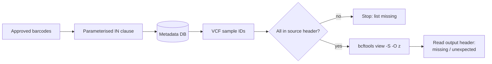

# Biobank Data Release Manager

[](https://github.com/dsugurtuna/biobank-data-release-manager/actions)

Helpers for releasing genotype data to an approved research project: turn approved sample lists into safe SQL, extract exactly those samples from a VCF with bcftools, and check the result.

> **Portfolio disclaimer:** This repository contains sanitised, generalised versions of tooling developed at NIHR BioResource. No real participant data or internal paths are included.

**Where this fits:** part of my clinical genomics and biobank data work. This repo extracts VCF
subsets; [genomic-cohort-delivery-pipeline](https://github.com/dsugurtuna/genomic-cohort-delivery-pipeline)
assembles PLINK cohorts from batches; and
[secure-genomic-transfer](https://github.com/dsugurtuna/secure-genomic-transfer) encrypts and
checksums files for transfer.

## The problem

A data access request is approved for a list of participants, usually identified by sample
barcodes. Someone has to map those barcodes to the IDs used in the genotype files, extract exactly
those samples, and prove the release contains no more and no fewer. Hand-built SQL lists and
unchecked extractions are where mistakes creep in.

## What this does

- **SQL helpers** (`SQLQueryBuilder`): a parameterised `IN` clause with values to bind (for code),
  or a literal `IN` clause with quotes escaped (for pasting into a database client). Empty lists
  and non-identifier column names are rejected. `clean_tsv_export` strips quotes and duplicate rows
  from database exports.
- **Extraction** (`GenotypeExtractor`): before extracting, checks that every requested sample is in
  the source VCF header and stops if not (or extracts the rest with `allow_missing=True`). Runs
  `bcftools view -S` with an explicit output type, then reads the output header and reports
  missing, unexpected and duplicate samples. `success` means an exact match.
- **Validation** (`SampleValidator`): compares a request list against a PLINK `.fam` or any ID set.

## Quickstart

```bash
git clone https://github.com/dsugurtuna/biobank-data-release-manager.git
cd biobank-data-release-manager
python -m venv .venv && source .venv/bin/activate
pip install -e ".[dev]"
pytest
python examples/demo.py
```

The demo uses synthetic barcodes and a synthetic VCF, an in-memory SQLite table as the metadata
database, and [`examples/fake_bcftools.py`](examples/fake_bcftools.py) in place of bcftools.
Output, checked by `tests/test_demo.py`:

```text
Approved barcodes: 4; with a VCF sample ID: 3
Extracted 3 of 3 requested
Exact match: True; missing: []
Second request: 1 requested sample(s) not in source; nothing extracted; missing: ['VCF099']
```

One approved barcode has no genotype data, which the lookup makes visible; the second request
names a sample the VCF does not contain, so nothing is extracted.

With real data (needs bcftools on `PATH`):

```python
from release_manager import GenotypeExtractor, SampleValidator, SQLQueryBuilder

sql, params = SQLQueryBuilder.build_parameterised_in_clause(barcodes, column_name="barcode")
# cursor.execute(f"SELECT vcf_sample_id FROM samples WHERE {sql}", params)

result = GenotypeExtractor().extract("cohort.vcf.gz", "samples.txt", "release.vcf.gz")
print(result.success, result.missing_samples, result.error)

report = SampleValidator().validate_fam("request.txt", "release.fam")
print(report.is_concordant, report.missing, report.unexpected)
```

## How it works



## Design decisions

- **Check before extracting.** `bcftools view -S` fails on the first unknown sample, and silently
  forcing past it hides the problem. Reading the header first gives the full list of missing
  samples in one go, and the choice to proceed without them is explicit.
- **Exact match, not equal counts.** A release with one wrong sample and one missing sample has the
  right count. Success compares sets.
- **Parameterised SQL by default.** Sample IDs come from spreadsheets and emails. Binding values is
  the standard defence against broken or injected SQL; the literal form escapes quotes for the
  cases where a query must be pasted.
- **Explicit bcftools output type.** The extension decides `-O`, so a `.vcf.gz` is compressed
  whatever the bcftools version (before 1.12, bcftools did not infer it from the name).
- **Report errors, do not raise, from `extract`.** A release run should end with a result object
  that says what happened, including bcftools' own error text.

## Limitations and what this is not

- Needs bcftools for real extraction; the tests and demo use a small stand-in that only mimics
  `query -l` and `view -S`.
- No output index is written (`bcftools index`), and region filtering (`-r`) needs an index on the
  source.
- It does not decide *who* is approved; the approved list comes from the access process.
- It does not encrypt or transfer the release; see
  [secure-genomic-transfer](https://github.com/dsugurtuna/secure-genomic-transfer).
- Some databases limit the number of items in an `IN` list; very long lists need chunking or a
  temporary table.
- `legacy/` holds the original shell scripts for reference; they simulate bcftools and are not
  tested.

## Roadmap

- Index the output and write a checksum manifest alongside it.
- Report which approved barcodes had no genotype data, by name.
- Chunked or temporary-table lookups for very long lists.

## Jira Provenance

- **WGS/WES data provisioning** — extracting participant subsets from master VCF files for approved data releases.
- **Sample concordance** — post-extraction auditing to verify delivery completeness.
- **SQL query automation** — formatting barcode lists for clinical database queries.

## Development

```bash
make dev     # install with dev dependencies
make check   # ruff lint and format check, mypy, pytest
```

See [docs/WHY.md](docs/WHY.md) for the reasoning behind the design, and
[CONTRIBUTING.md](CONTRIBUTING.md) to contribute.

## Licence

See [LICENSE](LICENSE).

---

Personal project by [Ugur Tuna](https://github.com/dsugurtuna). Not affiliated with or endorsed by any employer.
